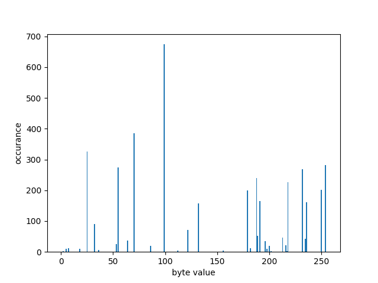
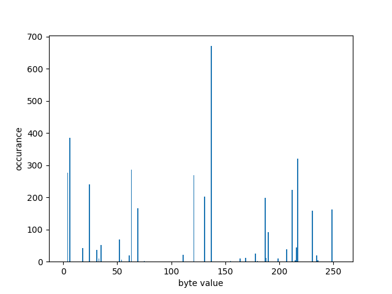
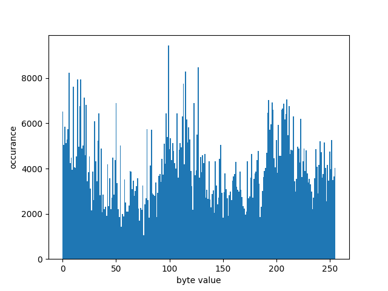
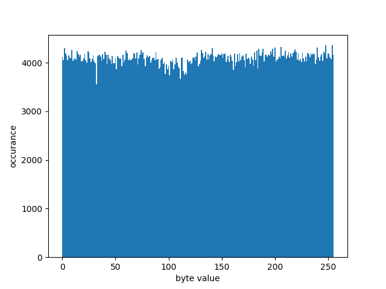
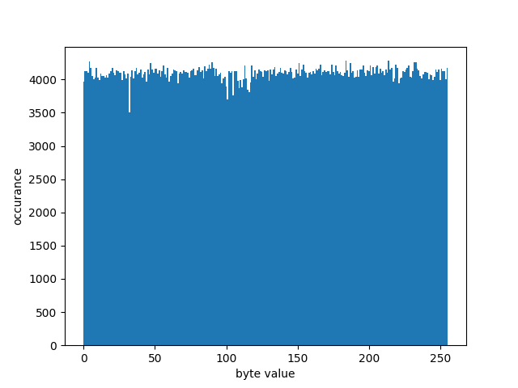

# Kauma

## Aufgabe 01 Bytenigma

### 1.2 Bewertung Bytenigma

#### Einleitung

Die Bytenigma fungiert durch ihre Rotoren als polyalphabetische Substitutionschiffre, die auf der Blockgröße eines Bytes agiert. Dabei wird jedes Datenwort auf ein anderes Datenwort abgebildet. Ein Datenwort kann niemals auf sich selbst abgebildet werden. Dies ergibt sich aus dem Hin- und Rückweg eines einzelnen Verschlüsselungsschrittes. Da der aktuelle Block nach dem Hinweg durch die Rotoren invertiert wird, muss auf dem Rückweg ein anderer Block rauskommen, als der Eingabeblock.  
Die Anzahl der zur Verschlüsselung verwendeten Substitutionsalphabete hängt von der Anzahl der Rotoren ab. Da die rotation der Rotoren und dem Überfluss des ersten Element eines Rotors, wiederholt sich dessen Reihenfolge immer nach 256n verschlüsselten Zeichen. N ist dabei die Anzahl der verwendeten Rotoren. Dies ergibt sich daraus, dass die grundlegende Konfiguration bekannt ist und es 256 Startpositionen pro Rotor gibt. Der Schlüsselraum entspricht dabei auch Periode der gesammten Konstruktion. Also ist die Konfiguration der Rotoren nach 256n Bytes identisch zur Startposition. 

#### Gibt es schwache Rotoren?

Ja es gibt schwache Rotoren, einer davon ist zum Beispiel [0,1,2...255]. Hierbei werden die Datenworte im ersten Block einfach nur invertiert. Ebenso lässt sich durch einen aus Null-Bytes bestehenden Klartext die lineare Abhängigkeit sofort sehen, wir ein solcher Rotor verwendet. Da die verwendeten Rotoren bekannt sind, ist es somit auch trvial die Startkonfiguration herauszufinden und somit den Schlüssel erhalten, wenn der Angreifer ein Klartext-Chiffrat paar besitzt. Dieser Angriff wird schwerer bei anderen Rotoren, ist jedoch immer noch bei einem Rotor leicht durchführbar. Durch den Schlüsselraum von 256 n ist es auch notwendig eine vielzahl von Rotoren zu verwenden, damit der Schlüssel nicht direkt einfach Bruteforced werden kann.

Also ja es gibt schwache Rotoren. 

#### Ist die Bytenigma kryptografisch stark, wenn randomisierte Rotoren gewählt werden?
 
Dadurch, dass es sich bei der Bytenigma um eine polyalphabetische Substitutionschiffre handelt, gibt es hierbei diesselben Probleme, wie bei anderen polyalphabetischen Substitionschiffren. Hierbei gibt es eine Neigung, die vom verwendeten Eingabewert abhängt. Da sich die Alphabete wiederholen, sobald die zu verschlüsselnde Nachricht länger als die Anzahl der Alphabete (256n) ist, lassen sich Häufigkeitsanalysen über verschlüsselte Texte machen. Somit können Nachrichten entschlüsselt werden, solange der verschlüsselte ein großes Vielfaches der Anzahl der benutzen Alphabete ist. 
Dieser Effekt besteht bei jedem möglichen Rotor, somit sind randomisierte Rotoren niemals sicher.
Ein Beispiel hierfür ist ein Lorem Ipsum (zu finden im Ordner analysis als lorem_ipsum.txt). Um die Sichtbarkeit des Effektes zu erhöhen wird zur Demonstration nur ein Rotor verwendet. Mit mehr Rotoren besteht dieser Effekt immer noch, jedoch muss die verschlüsselte Nachricht entsprechend lang genug sein. Als Rotor wurde der erste Rotor aus ./analysis/bias.json verwendet. Nachfolgend zu sehen ist das Histogramm des Chiffrats in alle 256 Bytes. Hierbei lässt sich die erwartete Verteilung eines lateinischen Alphabets beobachten. Auf der X-Achse sind dabei die verschiedenen Bytes zu sehen und auf der Y-Achse das Auftreten der Bytes. Diese Eigenshaften entstehen unabhängig von den gewählten Rotoren. 

Offset 0:

Offset 1:

Ohne Aufteilung:

Zusammen mit den entstehendenden Neigungen durch bestimmte Klartexte (nähere Beschreibung folgt im nächsten Abschnitt) ist kryptographisch gesehen nicht stark, da somit die Vertraulichkeit gebrochen ist und Erkenntnisse über den Klartext gewonnen werden können, ohne die Rotorenkonfiguration zu kennen, welche ja hierbei dem Schlüssel entspricht.

Ebenso ist durch die Existenz von unsicheren Rotoren eine zufällige Generierung von Rotoren nicht sicher. 

#### Wie gut sind die Eigenschaften der Ununterscheidbarkeit (indistinguishability) und Neigung (bias) bzw wie hängen diese mit der Anzahl der verwendeten Rotoren zusammen?

Ein weiterer Punkt, der eine Neigung ergibt und damit die Ununterscheidbarkeit bricht, ist die in der Einleitung genannte Eigenschaft, dass jedes Datenwort auf ein anderes Datenwort abgebildet wird. Dadurch lässt sich bei einer Nachricht bestehend aus ausschließlich Null-Bytes beobachten, dass das resultierende Chiffrat kein einziges Null-Byte enthällt. Dies ist allerdings bei einer Gleichverteilung von Bytes und einer ausreichend langen Nachricht extrem unwahrscheinlich. Auch auf Bit-Ebnene lässt sich diese Neigung nachweisen. 
Bei einer Gleichverteilung der Bits, sollten bei einer ausreichenden Menge an Daten annähernd 50% der Bits 0 und 50% der Bits 1 sein. Bei einer Ausgabe, die aus 0 bis 255 besteht, ist eine solche Gleichverteilung auch zu erwarten. Da es sich bei dieser kryptographischen Konstruktion jedoch um eine polyalphabetische Substitutionschiffre handelt und ein Datenwort niemals mit sich selbst ersetzt werden kann, ergibt das Chiffrat einer Nachricht, welche nur aus einer Verkettung desselben Zeichens besteht, eine Neigung abhängig vom gewählten Zeichen. 
Diese Neigung ist besonders stark bei dem Datenwort 0x00 und 0xff. Hierbei besteht das Ausgabealphabet dann nicht aus 1024 mal 1 und 1024 mal 0 Bits, sondern nur noch aus im Fall von 0x00: 1016 mal 0 und 1024 mal 1 und im Fall von 0xff umgekehrt. Damit ergibt sich eine Verteilung von 49,80% für das Bit 0 und 50,20% für das Bit 1 im Falle von 0x00, umgekehrt im Fall von Bit 0. Diese Verteilung lässt sich auch durch das verschlüsseln von 220 Null-Bytes beobachten. Die verwendete Rotoren-Konfiguration ist in der Datei bias.json im Ordner analysis zu finden. Hierbei ergab sich eine Verteilung: 0-Bit: 4177865 / 1-Bit: 4210743. Das entspricht mit einem Anteil von 49,80% der erwarteten Verteilung. Diese Ergebnisse waren auch mit allen getesteten Rotorenkombinationen beobachtbar. Nachfolgend ein Histrogramm der vorkommenden Bytes desselben Chiffrats. Das Histrogramm zeigt auf der X-Achse den Bytewert und auf der Y-Achse die Häufigkeit. Hierbei ist das fehlende Auftreten des Byte-Wertes 0 besonders auffällig.

Bezüglich der Frage, wie die Eigenschaft der Ununterscheidbarkeit mit der Anzahl der Rotoren zusammenhängt, so erhöht sich diese besonders bei Klartexten, welche einen starken Bias besitzen. Gerade wenn zum Beispiel nur lateinisches Alphabet verwendet wird, lässt sich diese Eigenschaft gut in einem Historgramm sehen. Zur Demonstration wurde hierfür ein Lorem Ipsum gewähl, welches im Order Analysis als lorem_ipsum.txt zu finden ist. Die verwendeten Rotoren sind unter lorem_ipsum.json zu finden. Hierfür wurde von den fünf Rotoren mit nur dem ersten Rotor (Index 0 angefangen) und dann wurden Iterativ die anderen Rotoren zusätzlich benutzt. Nachfolgend zeigen die drei Diagramme die Anzahl der Auftretenden Bytes im Chiffrat auf der Y-Achse und das entsprechende Byte auf der X-Achse. Man sieht, wie die Verteilung bei einem Klartext mit begrenztem Alphabet durch hinzufügen von Rotoren zunimmt.

Ein Rotor:

Zwei Rotoren:

Drei Rotoren:

Damit lässt sich abschließend sagen, dass die Eigenschaft der Ununterscheidbarkeit durch die entstehende Neigungen nicht erreichen lässt. Es lassen sich immer Klartexte finden, für die eine Neigung entsteht. Wir ein begrenztes Alphabet für den Klartext verwendet, so lässt sich die Neigung durch hinzufügen von Rotoren verringern und damit wird die Ununterscheidbarkeit für diesen Fall erhöht. Da sich damit aber immer noch Klartexte wählen lassen, bei welchen die Ununterscheidbarkeit nicht gegeben ist, ist diese Verschlüsselung immer noch kaputt. 

#### Abschließende Bewertung:

Die Bytenigame ist nicht kryptographisch gesehen nicht gut und bricht mehrere Eigenschaften und ist durch mehrere Angreifermodelle angreifbar. Manche davon brechen die Verschlüsselung komplett, wie zum Beispiel das Aufteilen des Chiffrats im Zusammenhang mit einer Häufigkeitsanalyse bei einem bekannten Alphabet. Ein anderes Beispiel ist das Verfehlen des Ziels der Ununterscheidbarkeit dadurch, dass ein Datenwort immer auf ein anderen abgebildet wird. Bei schwachen Konfigurationen (zu wenig Rotoren) kann es keinen sicheren Schlüssel geben, da alles einfach bruteforcebar ist.