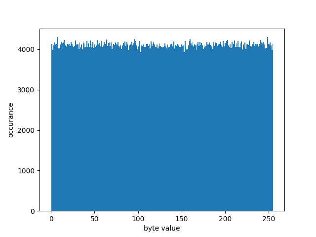

# Kauma

## Aufgabe 01 Bytenigma

### 1.2 Bewertung Bytenigma

#### Einleitung

Die Bytenigma fungiert durch ihre Rotoren als polyalphabetische Substitutionschiffre, die auf der Blockgröße eines Bytes agiert. Dabei wird jedes Datenwort auf ein anderes Datenwort abgebildet. Ein Datenwort niemals auf sich selbst abgebildet werden. Dies ergibt sich aus dem Hin- und Rückweg eines einzelnen Verschlüsselungsschrittes. Da der aktuelle Block nach dem Hinweg durch die Rotoren invertiert wird, muss auf dem Rückweg ein anderer Block rauskommen, als der Eingabeblock.  
Die Anzahl der zur Verschlüsselung verwendeten Substitutionsalphabete hängt von der Anzahl der Rotoren ab. Da die rotation der Rotoren und dem Überfluss des ersten Element eines Rotors, wiederholt sich dessen Reihenfolge immer nach 256n verschlüsselten Zeichen. N ist dabei die Anzahl der verwendeten Rotoren. 

#### Gibt es schwache Rotoren?

#### Ist die Bytenigma krpytografisch stark, wenn randomisierte Rotoren gewählt werden?
 

#### Wie gut sind die Eigenschaften der Ununterscheidbarkeit (indistinguishability) und Neigung (bias) bzw wie hängen diese mit der Anzahl der verwendeten Rotoren zusammen?

Dadurch, dass es sich bei der Bytenigma um eine polyalphabetische Substitutionschiffre handelt, gibt es hierbei diesselben Probleme, wie bei anderen polyalphabetischen Substitionschiffren. Hierbei gibt es einen Neigung, der vom verwendeten Input abhängt. Da sich die Alphabete wiederholen, sobald die zu verschlüsselnde Nachricht länger als die Anzahl der Alphabete (256n) ist, lassen sich Häufigkeitsanalysen über verschlüsselte Texte machen. Somit können Nachrichten entschlüsselt werden, solange der verschlüsselte ein großes Vielfaches der Anzahl der benutzen Alphabete ist. Hier ein Beispiel dafür: 

Ein weiterer Punkt, der eine Neigung ergibt und damit die Ununterscheidbarkeit bricht, ist die in der Einleitung genannte Eigenschaft, dass jedes Datenwort auf ein anderes Datenwort abgebildet wird. Dadurch lässt sich bei einer Nachricht bestehend aus ausschließlich Null-Bytes beobachten, dass das resultierende Chiffrat kein einziges Null-Byte enthällt. Dies ist allerdings bei einer Gleichverteilung von Bytes und einer ausreichend langen Nachricht extrem unwahrscheinlich. Auch auf Bit-Ebnene lässt sich diese Neigung nachweisen. 
Bei einer Gleichverteilung der Bits, sollten bei einer ausreichenden Menge an Daten annähernd 50% der Bits 0 und 50% der Bits 1 sein. Bei einer Ausgabe, die aus 0 bis 255 besteht, ist eine solche Gleichverteilung auch zu erwarten. Da es sich bei dieser kryptographischen Konstruktion jedoch um eine polyalphabetische Substitutionschiffre handelt und ein Datenwort niemals mit sich selbst ersetzt werden kann, ergibt das Chiffrat einer Nachricht, welche nur aus einer Verkettung desselben Zeichens besteht, eine Neigung abhängig vom gewählten Zeichen. 
Diese Neigung ist besonders stark bei dem Datenwort 0x00 und 0xff. Hierbei besteht das Ausgabealphabet dann nicht aus 1024 mal 1 und 1024 mal 0 Bits, sondern nur noch aus im Fall von 0x00: 1016 mal 0 und 1024 mal 1 und im Fall von 0xff umgekehrt. Damit ergibt sich eine Verteilung von 49,80% für das Bit 0 und 50,20% für das Bit 1 im Falle von 0x00, umgekehrt im Fall von Bit 0. Diese Verteilung lässt sich auch durch das verschlüsseln von 220 Null-Bytes beobachten. Die verwendete Rotoren-Konfiguration ist in der Datei bias.json im Ordner analysis zu finden. Hierbei ergab sich eine Verteilung: 0-Bit: 4177865 / 1-Bit: 4210743. Das entspricht mit einem Anteil von 49,80% der erwarteten Verteilung. Diese Ergebnisse waren auch mit allen getesteten Rotorenkombinationen beobachtbar. Nachfolgend ein Histrogramm der vorkommenden Bytes desselben Chiffrats. Das Histrogramm zeigt auf der X-Achse den Bytewert und auf der Y-Achse die Häufigkeit. Hierbei ist das fehlende Auftreten des Byte-Wertes 0 besonders auffällig.

#### Abschließende Bewertung: